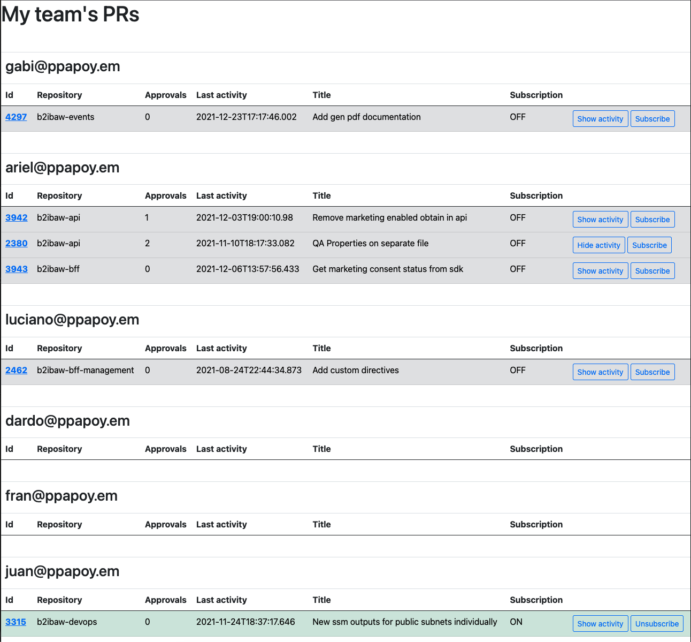
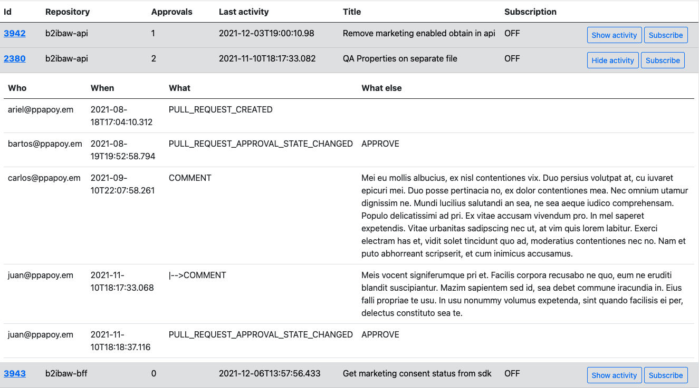
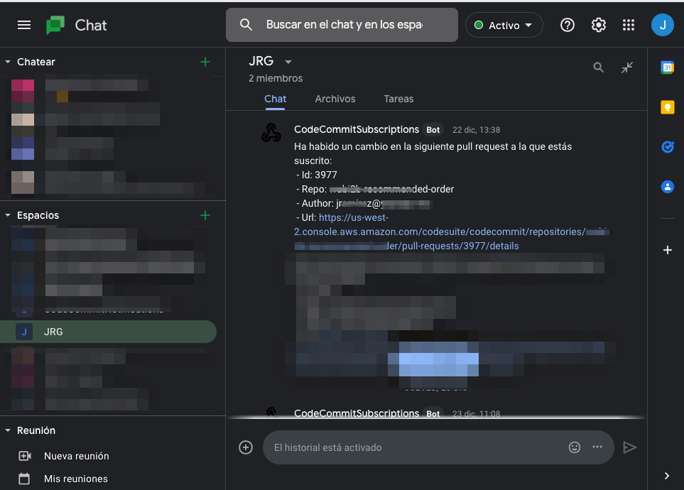

# ShorcutsAWS
## Description
It is a web application that is executed on the local machine. Its interface is reached by accessing http://localhost:3355/dashboard.
- Given a list of CodeCommit repositories and a list of users, the application __displays the list of pull requests__ opened by each of the users in each of the repositories.
- You can __show the activity of each pull request__, showing the list of events produced on the pull request.
- You can __subscribe to__ every __pull request__. The application will check periodically (every minute), if there has been any change on the pull request, in case of finding a change, you will be notified via Google Chat.

The application uses a json file (~/.shortcutsAws/config.json) to store its configuration and state. The json object contained in this file has the following properties:
- repos: List of CodeCommit repository names on which open pull requests will be searched.
- authors: List of CodeCommit user names for which open pull requests will be searched.
- googleChatUrl: Google Chat URL to which notifications will be sent
- notificationsEnabled: Indicates if notifications are active.
- subscriptions: Store of the subscription status.

When accessing the application url, a search will be made for Pull Requests opened by the users present in the "authors" property of the configuration file for each of the repositories present in the "repos" property of the configuration file. This action that is repeated each time the url is accessed and each time the page is refreshed, it may take about 10 seconds to complete.
The application will show the list of users, and for each user, their open pull requests:

You can check the activity of each pull request by clicking on the "Show activity" button:

You can subscribe to a pull request by clicking on the "Subscribe" button. The application will check periodically (every minute), if there has been any change on the pull request, in case of finding a change, you will be notified via Google Chat.

When a Pull Request to which you are subscribed is closed, the subscription will be deleted and you will be notified of this fact.

## Installation and configuration
### Requirements
#### AWS CLI
The application communicates with CodeCommit using the [AWS CLI](https://docs.aws.amazon.com/cli/latest/userguide/cli-chap-welcome.html), therefore, it is necessary to have it installed and configured. You can check if you have it installed by running this in a terminal:
~~~
    aws --version
~~~
In case you don't have it installed, you will have to [install](https://docs.aws.amazon.com/cli/latest/userguide/getting-started-install.html) it  and [configure](https://docs.aws.amazon.com/cli/latest/userguide/cli-chap-configure.html) it.
#### Google chat
For the notifications to work, you will need to provide the URL of a Google Chat webhook. 

You can create a webhook by following these steps:
1. Open Google Chat in your browser.
2. Create a new space dedicated to CodeCommit notifications or choose an existing one.
3. Go to the space to which you want to add a bot.
4. From the menu at the top of the page, select Configure webhooks.
5. Under Incoming Webhooks, click ADD WEBHOOK.
6. Name the new webhook 'ShortcutsAWS' and click SAVE.
7. Copy the URL listed next to your new webhook in the Webhook Url column.
8. Click outside the dialog box to close.

### The configuration file
The application will search for the configuration file "${System.getProperty("user.home")}/.shortcutsAws/config.json". Therefore,
1. Create the directory "./shortcutsAws" within the home of your system user.
2. Copy in the newly created directory, the existing example file in this project in src/main/resources/example-config/config.json.
3. Fill the "repos" field with all the names of repositories on which you want to consult open pull requests.
4. Fill in the "authors" field with all the user names on which you want to consult open pull requests.
5. Keep the "notificationsEnabled" field to true, in case you want to receive notifications.
6. Fill in the "googleChatUrl" field with the URL of the Google Chat webhook that you got in the previous section, in case you want to receive notifications.
7. Keep the "subscriptions" field as it currently is.

### Get run
Download the source code and run:
~~~
./gradlew build
~~~
Unzip the resulting .tar file, in your preferred destination directory, for example "~/bin":
~~~
tar -xvf build/distributions/ShortcutsAWS-1.0-SNAPSHOT.tar -C ~/bin
~~~
Now you can start the application by running the script:
~~~
~/bin/ShortcutsAWS-1.0-SNAPSHOT/bin/ShortcutsAWS
~~~
It is recommended to configure the execution of the script as a service or at least create a script to run in the background:
~~~
#!/bin/bash
cd ~/bin/ShortcutsAWS-1.0-SNAPSHOT/bin
nohup ./ShortcutsAWS > shortcuts.log &
~~~

# API REST
The application exposes some endpoints to serve the HTML documents:
- GET /dashboard
- GET /dashboard/activity/:pullRequestId

And also it also exposes a Rest API with some functionalities:
- Count approvals for pull request:
  - GET approvals/:pullRequestId
- Get activity for pull request:
  - GET pr/activity/:pullRequestId
- List Open PRs:
  - GET prs
- Subscribe to pull request:
  - PUT subscribe/pr/:pullRequestId
- Unsuscribe to pull request:
  - PUT unsubscribe/pr/:pullRequestId
 